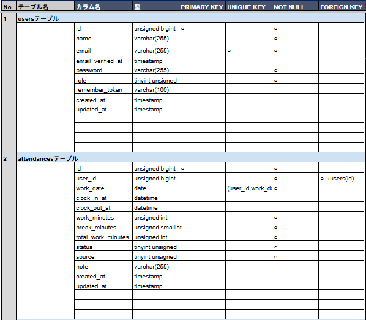
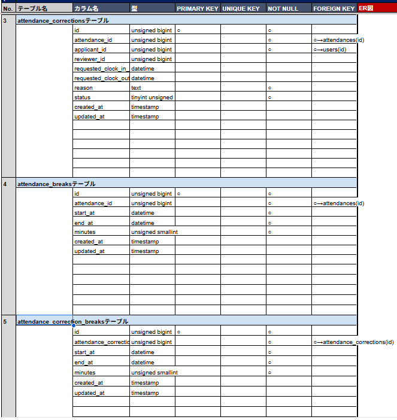
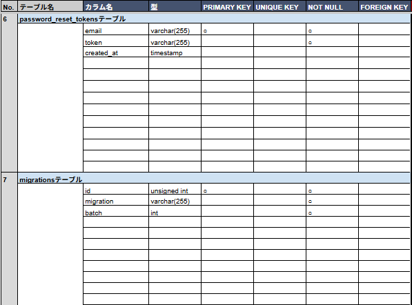

# 環境構築

## Docker ビルド

1.docker-compose up -d --build

## Laravel 環境構築

1.docker-compose exec php bash
2.composer create-project "laravel/laravel=11.\*" . --prefer-dist
3..env に以下の環境変数を追加

    DB_CONNECTION=mysql
    DB_HOST=mysql
    DB_PORT=3306
    DB_DATABASE=laravel_db
    DB_USERNAME=laravel_user
    DB_PASSWORD=laravel_pass

4.マイグレーションの実行
php artisan migrate

5.シーディングの実行
php artisan db:seed

6.シンボリックリンクの作成
php artisan storage:link

## 開発環境

・ユーザー登録画面：http://localhost/register
・phpMyAdmin：http://localhost:8080

## 使用技術（実行環境）

PHP8.2.9
Laravel11.45.2
MySQL8.0.26
Nginx1.21.1

## セッション設定

ファイルセッション
`.env` に `SESSION_DRIVER=file` を設定
`session.php` に `'driver' => env('SESSION_DRIVER', 'file')` を設定

## テーブル設計

